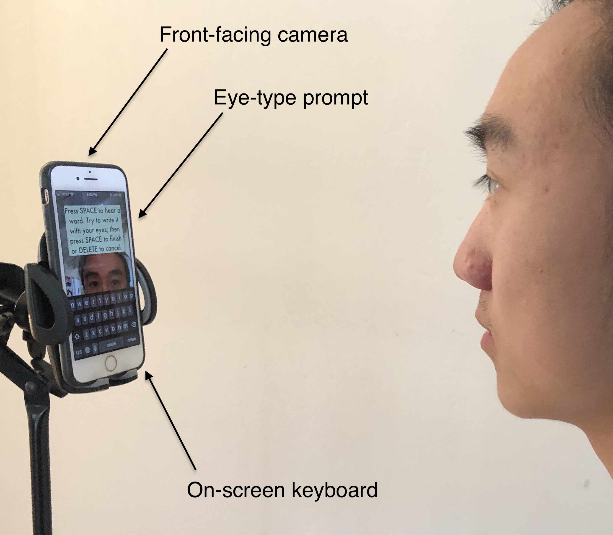
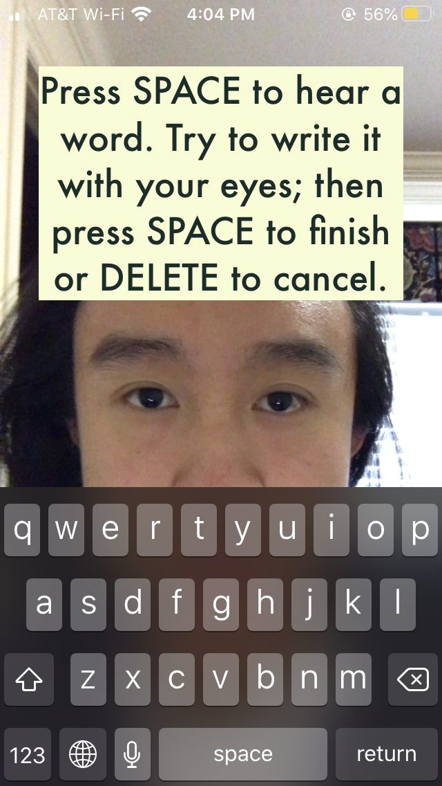

## Inspired by Swipe Keyboards

EyeSwipe is a proposed fast eye-based user interface for digital devices, initially enabling ALS and other neurologically constrained patients to speak using their eyes much faster than now possible. We plan to make an eye-tracking equivalent of a swipe keyboard–a smartphone app which can be mounted in front of a user's eyes.

## Existing technology

(insert media here to show usage of Dynavox?)

High-precision eye-tracking systems such as [Tobii/Dynavox](https://www.tobiidynavox.com/en-us/about/about-us/how-eye-tracking-works/) are costly, at $5000-15000, and rarely exceed ~20-25 WPM. EyeSwipe aims to make comfortable 60-80 WPM eye-typing feasible, by applying neural networks trained on videos of eyes typing known phrases.

## The Concept

- No visual feedback
- No autocomplete confirmation
- Faster than dwell

## How it works

### Data collection app:

Built for iOS, this app:

1. Delivers auditory ground truth phrases to the user, and captures video via front-facing camera as they eye-type the phrase.

2. Allows distributed data collection and labeling to facilitate RNN model building.

3. Provides testing of an initial UI design which will inform the final keyboard app.

Current progress can be found in this repository: [kaolin-eyeswipe-recorder](https://github.com/EyeSwipe/EyeSwipe/tree/master/kaolin-eyeswipe-recorder)

Unlike the final product, this data collection app requires the user (or an assistant) to move the device into position, manipulate the screen, and press "space" to start recording. As we continue developing the app, we will move toward a fully eye-based interface, with automatic calibration, auditory stimuli, etc. for the target users.

---
easy markdown formatting options (edit the readme to see this!):

**Bold** and _Italic_ and `Code` text
## Title Text
[Link](url)

